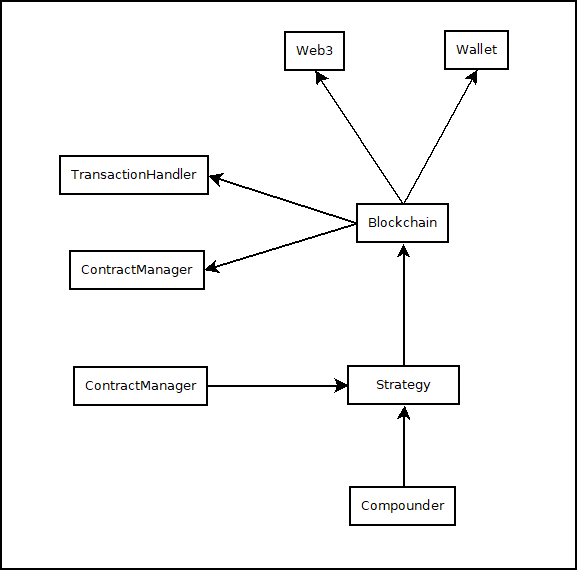

# PolyAutoCompounder

Pool Auto Compounder for the Polygon (MATIC) network.
Currently works for PZAP only.

## DISCLAIMER

This is a side-project, for personal use and learning purposes, and it may fall unmainteined in the future.

Even now I cannot assure completely correct handling of your tokens.

Don't use this with money you're afraid to lose. Maybe don't use it at all.

Read the code, use at your own discretion and always DYOR.

## Installation

Clone the repo and install dependencies.

```bash
$ git clone https://github.com/manuelpepe/PolyAutoCompounder
$ cd PolyAutoCompounder
$ python3 -m venv venv
$ source venv/bin/activate
$ pip install -r requirements.txt
```

## Configuration

### Configure wallet address and RPC 

Copy and edit the project config:

```bash
$ cp PolyCompounder/resources/config.sample.json PolyCompounder/resources/config.json
$ vim PolyCompounder/resources/config.json
```

You'll also need to create the file `PolyCompounder/resources/key.file` with your encrypted private key.

To create one see [here](https://web3py.readthedocs.io/en/stable/troubleshooting.html#how-do-i-use-my-metamask-accounts-from-web3-py) (TODO: `create-keyfile` script)

### Defining strategies

You can modify the `resorces/strategies.json` file to customize strategies. 

Run `PolyCompounder/cli.py list-strategies -v' to see available strategies and parameters.


## Running

```bash
(venv) $ python PolyCompounder/cli.py list-strategies -v
(venv) $ python PolyCompounder/cli.py run
```

## Example

Successful compound: 

```
$ python PolyCompounder/core.py 
Enter wallet password: 

Compounding PZAP-WBTC
Pending rewards: 0.41093465
* Harvesting...
Block Hash: 0x5523b2a4328426daa14dbf30db07398fb846450s7d9aac21295328edf7a491f3e
Gas Used: 134873
* Swapping 0.20651803 PZAP for 0.00000998 WBTC...
Block Hash: 0x71cfd9a4002ae75f9d9515233s6334d14a1c223613abe53dea6dd33ff7df3d16
Gas Used: 118255
* Adding liquidity (0.20445285 PZAP + 0.00000991 WBTC)...
Block Hash: 0x31efebve826aad1ea192ac313f3aba45027158dda1640da0b9362f0beabd25548
Gas Used: 171761
* Staking 0.000000014057571878 LPs to PZAP-WBTC...
Block Hash: 0x35506c71a44972a45a6c0732c6a6cb0a44887b23d017a27957a21d17b1222fa7
Gas Used: 139469

Done
```

## Developing

The project structure is as follows:



The `Blockchain` exposes the auth, transaction and contract interfaces, allowing strategies to interact with the
network and compound pools (or anything else).

You can inherit `Strategy` to create your own compounding strategies.


## Extending

### Adding extra PZAP pairs

The easiest pairs to add are PZAP pairs.

1. Add the secondary token .abi file into resources and create a new entry for the ContractManager.
2. Extend `PZAPCompoundTask` and redefine class attributes.
3. Instanciate new task and pass to `Compounder`. 

In the future you should be able to add the abi file and configure the available contracts with a json file.
